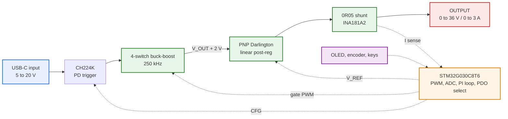
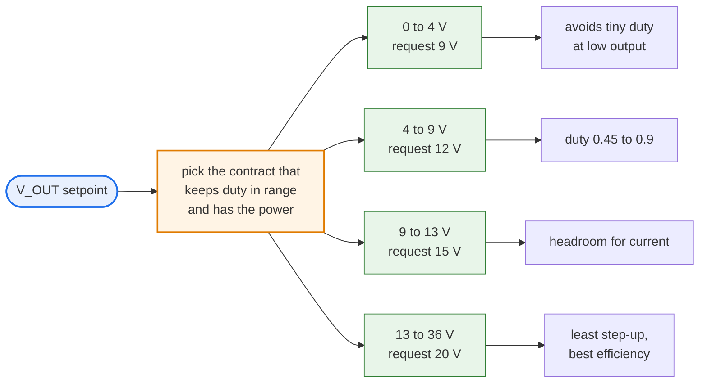
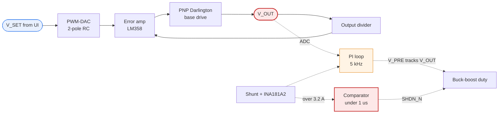

<div align="center">

# USB-C PD Bench Power Supply

### 0 – 36 V · 0 – 3 A · from a phone charger

4-switch synchronous buck-boost pre-regulator followed by a PNP-Darlington linear post-regulator —
laboratory-grade output from a USB-C source.

[](sch.pdf)
[](https://kicad.org)
[](erc.rpt)

**[📄 Read the schematic →](sch.pdf)**

</div>

---

## Specification

| | |
|---|---|
| **Output** | 0 – 36 V, 0 – 3 A, continuously adjustable |
| **Max power** | limited by the source contract, not by the topology — see below |
| **Input** | USB-C — any PD contract, **or a legacy 5 V port**.  The buck-boost stage means the input voltage never limits the output voltage. |
| **Topology** | switching pre-regulator + linear post-regulator |
| **Ripple** | linear final stage — switching noise never reaches the output |
| **Protection** | polyfuse · 24 V TVS · hardware over-current under 1 µs · firmware OVP |
| **Control** | STM32G030C8T6, 5 kHz PI loop |
| **Interface** | 0.96″ OLED · rotary encoder · 3 keys · 10 indicator LEDs |

---

## Architecture



**Two stages, because neither alone is enough.** A switcher is efficient but noisy. A linear
regulator is quiet but burns the entire input-to-output difference as heat.

So the switcher does the bulk conversion and parks itself ~2 V above the target; the linear stage
drops only that last 2 V and absorbs all the ripple.

> Feeding the linear stage a fixed 20 V at 1 V / 3 A output would burn **57 W**.
> Tracking headroom keeps it near **6 W**.

Because the pre-regulator both bucks *and* boosts, the output voltage is independent of whatever
the charger negotiated. A 5 V source can drive a 36 V output; it just cannot drive it at 3 A.

---

## Adaptive PD negotiation

**The buck-boost stage decouples input from output.** Any negotiated voltage can produce any
output voltage — 20 V out from a 5 V contract works fine electrically (boost duty 0.77). The
contract does not limit the output *voltage*.

What it limits is **current**, because power has to balance:

| Contract | at 5 V out | at 12 V out | at 24 V out | at 36 V out |
|---|:---:|:---:|:---:|:---:|
| 5 V / 3 A — 15 W | 2.0 A | 0.9 A | 0.5 A | 0.3 A |
| 9 V / 3 A — 27 W | 3.0 A | 1.7 A | 0.9 A | 0.6 A |
| 12 V / 3 A — 36 W | 3.0 A | 2.3 A | 1.2 A | 0.8 A |
| 15 V / 3 A — 45 W | 3.0 A | 2.8 A | 1.5 A | 1.1 A |
| **20 V / 1.75 A — 35 W** | 3.0 A | 2.2 A | 1.2 A | 0.8 A |
| 20 V / 3 A — 60 W | 3.0 A | 3.0 A | 2.1 A | 1.4 A |

So a **35 W charger reaches 36 V out at ~0.8 A**, and 20 V at ~1.2 A. The contract never blocks a
voltage — it only caps the current. 3 A is the hardware ceiling set by the shunt and the pass
device.

### So why negotiate at all?

Two reasons, and neither is about reaching the voltage:



**Duty-cycle range.** With 20 V in and 3 V out, the gate driver's 520 ns dead-time leaves only
~80 ns of real conduction and the loop pulse-skips. Requesting a lower voltage keeps the duty
cycle controllable.

**Efficiency.** Converting 20 V down to 5 V wastes more than converting 9 V down to 5 V. Picking
the nearest useful contract minimises the conversion ratio.

The firmware reads the source's advertised PDO list and takes the best available — it does not
assume 60 W is on offer. Boundaries carry 1.5 V of hysteresis, and the output is disabled during
renegotiation.

---

## Design highlights

<table>
<tr><td width="50%" valign="top">

### 🔌 Works on any USB-C port

Full PD gets the whole 0–20 V range. A **legacy 5 V port** still boots and runs, clamped to what
it can deliver.

Two details make that work:

- the logic LDO is fed from the **+12 V rail**, not VBUS — a legacy port sits at ~4.75 V, below
  the regulator's dropout
- **CFG1 is pulled high**, so a bare board requests 5 V before firmware even runs

</td><td width="50%" valign="top">

### 🛡 Protection that doesn't need firmware

A comparator pulls both gate drivers down in **under 1 µs**, independent of the MCU.

The fault LED lights **even if the processor has crashed** — which is the entire point of a
hardware trip.

Firmware then latches the fault and holds the output off until it's cleared.

</td></tr>
<tr><td valign="top">

### 🛑 Output kill is never in a menu

A **dedicated OUTPUT key** on its own interrupt.

If the board under test starts smoking, one press stops it — no scrolling, no mode, no waiting
for the UI task to notice.

</td><td valign="top">

### 🔍 24 test points

Kelvin taps at the current shunt, paired grounds so every scope probe has a short return, and
1.0 mm pads on the switch nodes to keep copper on the high-dv/dt net minimal.

</td></tr>
</table>

---

## Control loop



Headroom is **adaptive**, not a flat 2 V:

```
V_head = clamp(1.6 V + 0.35 Ω × I_out,  2.0 V,  3.0 V)
```

Slew-limited so the pre-regulator leads on rising steps and lags on falling ones — V_PRE must
never dip below V_OUT + V_CE(sat).

---

## User interface

| Control | Function |
|---|---|
| **Rotary encoder** | adjust the selected field |
| **Encoder push** | coarse / fine step (×1 · ×10 · ×100) |
| **OUTPUT** | dedicated on/off — own interrupt, always responsive |
| **SELECT** | cycle V-set → I-limit → digit |
| **BACK** | back; long-press clears a latched fault |

**10 indicator LEDs** — three rail-health, output live, constant-current mode, firmware heartbeat,
PD contract status, fault, and UART activity.

Seven are driven directly by hardware, which is deliberate:

- **PD_PG** is driven by the PD controller itself — it shows at a glance whether you got a real
  contract or fell back to legacy 5 V
- **FAULT** is driven by the over-current comparator, so it lights *even when the MCU is dead*.
  A firmware-driven fault lamp cannot do that.

The remaining three — **OUT**, **CC** and **HB** — are on GPIO, and the firmware uses them as a
diagnostic code so a fault can be identified without a scope or a serial cable.

### Planned blink codes

> Firmware is not yet written. This is the diagnostic scheme the hardware supports.

`HB` carries the rhythm; `OUT` and `CC` encode the fault as two bits.

| HB | OUT | CC | Meaning |
|:---|:---:|:---:|:---|
| steady 1 Hz | — | — | running normally |
| 2 blinks | off | off | over-current trip |
| 2 blinks | **on** | off | over-voltage |
| 2 blinks | off | **on** | over-temperature |
| 2 blinks | **on** | **on** | pre-regulator lost tracking |
| 3 blinks | off | off | PD negotiation failed |
| 3 blinks | **on** | off | legacy 5 V port — output range clamped |
| 3 blinks | off | **on** | ADC or reference out of range |
| solid on | **on** | **on** | firmware fault — watchdog reset pending |

Three GPIO-driven LEDs give **8 distinguishable fault states**, and the two hardware-driven lamps
(PD_PG, FAULT) stay valid even if the processor has stopped — so a dead MCU is itself
diagnosable.

---

## Engineering decisions worth asking about

> These are the judgement calls. Reasoning is in [`AUTHORSHIP.md`](AUTHORSHIP.md) and in notes on
> the sheets themselves.

- **The ground plane is not split** between the switching and linear sections. The stages are in
  *series*, so there is one return current — a slot would force it to detour and enlarge the loop.
  Separation is done by placement, with the analog reference starred at the output cap negative.
- **The current shunt is high-side**, so the output negative stays at true ground and the sense
  network carries only microamps.
- **The pass device is a PNP Darlington**, not an NPN follower — an NPN would need V_OUT + 1 V of
  drive, impossible at the top of the range.
- **Linear headroom is adaptive** and slew-limited, not a fixed offset.

---

## Firmware

Bare-metal C, no HAL. **3.0 KB flash, 40 bytes RAM.**

```bash
cd firmware && make
```

The analogue loop does the fast regulation; firmware supervises:

| Layer | Does | Speed |
|---|---|---|
| LM358 + PNP Darlington | holds V_OUT at the reference | analogue |
| Comparator → SHDN_N | kills the drivers on over-current | < 1 µs, no MCU |
| Firmware PI loop | keeps V_PRE ≈ V_OUT + headroom | 5 kHz |
| Supervisor | limits, PDO choice, UI, diagnostics | 100 Hz |

### Battery emulation

A cell sags under load, and that is the entire model:

```c
V_out = V_oc − I_load × R_internal
```

Both adjustable from the panel — 3.7 V / 100 mΩ for a Li-ion cell, 12.6 V /
20 mΩ for a small lead-acid pack. The current sense and voltage reference are
already in the loop, so this needs no extra hardware.

**Source-side only.** A real battery accepts charge; sinking current needs a
two-quadrant output stage, which the PNP pass device cannot do. That is the
next hardware revision.

See [`firmware/README.md`](firmware/README.md) for the pin map and the
diagnostic blink codes.

---

## Verification

| Check | Result |
|---|---|
| KiCad ERC errors | **0** |
| Orphan / unconnected parts | **0** |
| Dangling or single-pin nets | **0** |
| Shorted two-terminal parts | **0** |
| Auto-named nets | **0** — all **85** nets named for layout |
| Items off-page or clashing with the title block | **0** |
| Analogue nets on real ADC channels | **6 / 6** |
| Firmware pin map vs schematic netlist | **27 / 27 match** |
| Firmware build | **clean, 0 warnings** |

Several faults were caught during checking that had passed visual inspection — a pass transistor
whose collector and emitter had landed on the same net, six UI inputs chained together through
their debounce grounds, and reversed LED polarity. Details in [`AUTHORSHIP.md`](AUTHORSHIP.md).

---

## Revision history

| Rev | Status | What changed |
|---|---|---|

| **early** | superseded | single-sheet layout — included as page 4 of the PDF |
| **v1.1** | superseded | snubbers · +12 V gate rail on-sheet · hardware OCP · IRS2104 drivers · INA181A2 sense · STM32G030C8T6 · full UI. Output 0–20 V. |
| **v1.2** | **current** | output range raised to **0–36 V** (63 V bulk caps, rescaled dividers); all analogue nets moved onto real ADC channels; firmware added |

The earlier single-sheet revision had no snubbers on the switch nodes and left the +12 V gate
rail as an off-sheet module. Both are resolved here.

---

## Repository

| File | |
|---|---|
| **[`sch.pdf`](sch.pdf)** | **4-page schematic — start here** |
| **[`docs/design-evolution.pdf`](docs/design-evolution.pdf)** | **how the design got here — every revision, v0.3 to v1.3** |
| `usbc_pd_psu.kicad_sch` | KiCad 9 project (root sheet) |
| `power.kicad_sch` | sheet 1 — input, PD trigger, 12 V rail, buck-boost, drivers, OCP |
| `control.kicad_sch` | sheet 2 — post-regulator, current sense, MCU, UI |
| `bom.csv` · `netlist.net` · `erc.rpt` | outputs |
| `firmware/` | bare-metal C: control loop, battery emulation, diagnostics (`hw` / `control` / `pd` / `ui`) |
| [`AUTHORSHIP.md`](AUTHORSHIP.md) | design reasoning and provenance |

Drawn in **KiCad 9** using stock symbol and footprint libraries only — no custom parts, so the
project opens cleanly on any KiCad 9 installation.

---

## Status and honest caveats

> **Design complete, not yet built.** No hardware has been assembled or tested.

Known open items, carried deliberately:

- Dead-time is **13 % of the switching period** at 250 kHz. Dropping to 150 kHz with a 47 µH
  inductor would cut it to 7.8 %, at the cost of a physically larger inductor.
- V_PRE reaches 39 V at full output. The 60 V bridge FETs keep 54 % margin; output and V_PRE
  bulk caps are 63 V parts. Going beyond 36 V would need 100 V FETs.
- Input capacitance exceeds the USB hot-plug limit. PD sources tolerate it in practice; strict
  compliance needs a soft-start FET.

---

<div align="center">

**Mohammadreza Safaeian**

[m.re.safaeian@gmail.com](mailto:m.re.safaeian@gmail.com) · [github.com/mohammadrezasafaeian](https://github.com/mohammadrezasafaeian)

© 2026 Mohammadreza Safaeian. All rights reserved — see [LICENSE](LICENSE).

</div>
